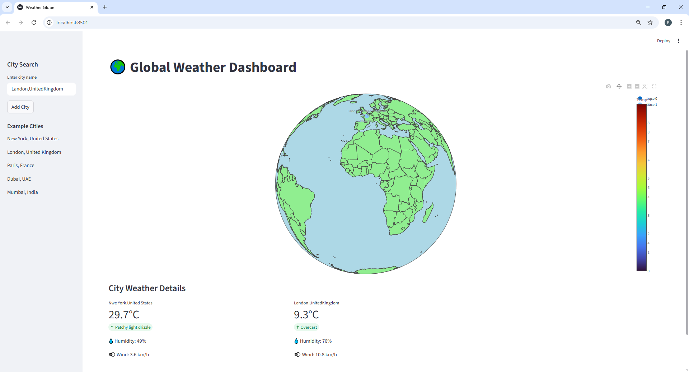

# 🌍 Weather Globe Dashboard

A simple interactive weather dashboard built with **Streamlit**, **Plotly**, and **WeatherAPI**.  
It allows users to search for cities and view their **real-time weather on a 3D globe**.

---

## 🚀 Features

- 🌍 Interactive globe visualization
- 🔍 Search and add cities
- 🌡️ Real-time temperature display
- 💧 Humidity information
- 💨 Wind speed data
- 📊 Weather summary cards
- 🧭 Example cities for quick testing

---

## 🛠️ Tech Stack

- Python
- Streamlit
- Plotly
- WeatherAPI
- Requests

---

## 📦 Installation

### 1️⃣ Clone the repository

```bash
git clone https://github.com/AbdulKadir80/weather-globe-dashboard.git
cd weather-globe-dashboard
```

### 2️⃣ Install dependencies

```bash
pip install streamlit requests plotly
```

---

## 🔑 API Setup

1. Create a free account at  
   https://www.weatherapi.com/

2. Get your API key.

3. Add the key in the code:

```python
API_KEY = "your_api_key_here"
```

---

## ▶️ Run the App

```bash
streamlit run wheatherapp.py
```

The application will open automatically in your browser.

---

## 📸 Application Preview

<p align="center">
  
</p>


## 📁 Project Structure

```
weather-globe-dashboard
│
├── wheatherapp.py
├── README.md
└── requirements.txt
```

## 📜 License

This project is open source and available under the **MIT License**.
